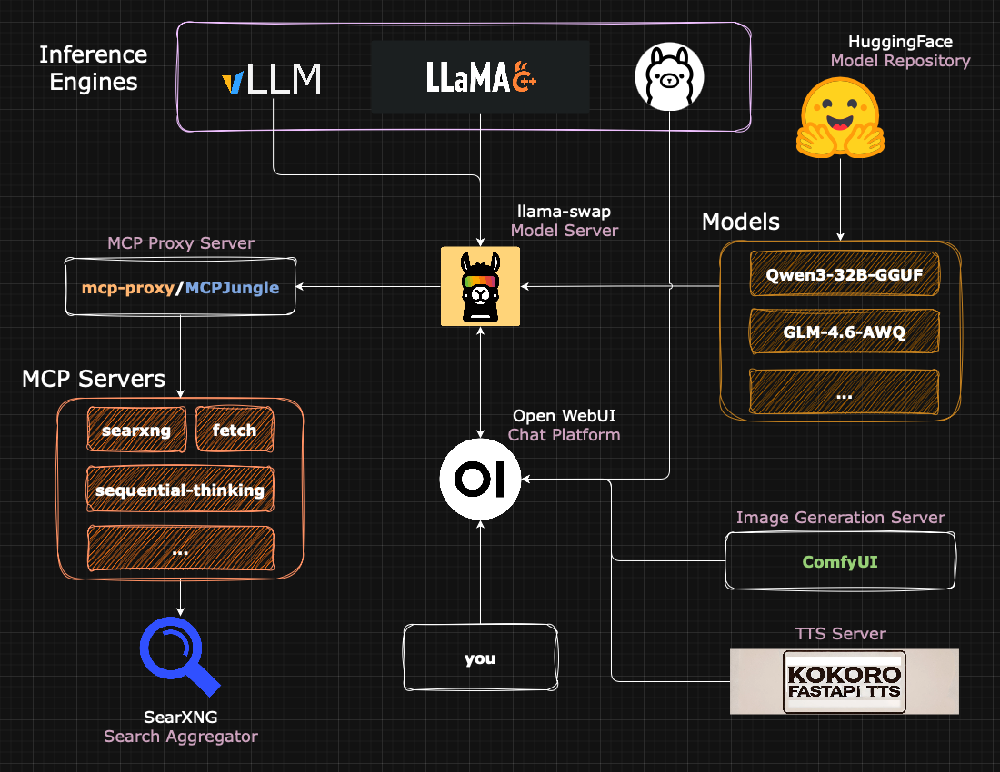

# Local LLaMA Server Setup Documentation

_TL;DR_: End-to-end documentation to set up your own local & fully private LLM server on Debian. Equipped with chat, web search, RAG, model management, MCP servers, image generation, and TTS, along with steps for configuring SSH, firewall, and secure remote access via Tailscale.

Software Stack:

- Inference Engine ([Ollama](https://github.com/ollama/ollama), [llama.cpp](https://github.com/ggml-org/llama.cpp), [vLLM](https://github.com/vllm-project/vllm))
- Search Engine ([SearXNG](https://github.com/searxng/searxng))
- Model Server ([llama-swap](https://github.com/mostlygeek/llama-swap), `systemd` service)
- Chat Platform ([Open WebUI](https://github.com/open-webui/open-webui))
- MCP Proxy Server ([mcp-proxy](https://github.com/sparfenyuk/mcp-proxy), [MCPJungle](https://github.com/mcpjungle/MCPJungle))
- Text-to-Speech Server ([Kokoro FastAPI](https://github.com/remsky/Kokoro-FastAPI))
- Image Generation Server ([ComfyUI](https://github.com/comfyanonymous/ComfyUI))



## Table of Contents

- [Local LLaMA Server Setup Documentation](#local-llama-server-setup-documentation)
  - [Table of Contents](#table-of-contents)
  - [About](#about)
  - [Priorities](#priorities)
  - [Prerequisites](#prerequisites)
  - [General](#general)
    - [Schedule Startup Script](#schedule-startup-script)
    - [Configure Script Permissions](#configure-script-permissions)
    - [Configure Auto-Login (optional)](#configure-auto-login-optional)
  - [Docker](#docker)
    - [Nvidia Container Toolkit](#nvidia-container-toolkit)
    - [Create a Network](#create-a-network)
    - [Helpful Commands](#helpful-commands)
  - [HuggingFace CLI](#huggingface-cli)
    - [Manage Models](#manage-models)
    - [Download Models](#download-models)
    - [Delete Models](#delete-models)
  - [Search Engine](#search-engine)
    - [SearXNG](#searxng)
    - [Open WebUI Integration](#open-webui-integration)
  - [Inference Engine](#inference-engine)
    - [Ollama](#ollama)
    - [llama.cpp](#llamacpp)
    - [vLLM](#vllm)
    - [Open WebUI Integration](#open-webui-integration-1)
    - [Ollama vs. llama.cpp](#ollama-vs-llamacpp)
    - [vLLM vs. Ollama/llama.cpp](#vllm-vs-ollamallamacpp)
  - [Model Server](#model-server)
    - [llama-swap](#llama-swap)
    - [`systemd` Service](#systemd-service)
    - [Open WebUI Integration](#open-webui-integration-2)
      - [llama-swap](#llama-swap-1)
      - [`systemd` Service](#systemd-service-1)
  - [Chat Platform](#chat-platform)
    - [Open WebUI](#open-webui)
  - [MCP Proxy Server](#mcp-proxy-server)
    - [mcp-proxy](#mcp-proxy)
    - [MCPJungle](#mcpjungle)
    - [Comparison](#comparison)
    - [Open WebUI Integration](#open-webui-integration-3)
      - [mcp-proxy](#mcp-proxy-1)
      - [MCPJungle](#mcpjungle-1)
    - [VS Code/Claude Desktop Integration](#vs-codeclaude-desktop-integration)
  - [Text-to-Speech Server](#text-to-speech-server)
    - [Kokoro FastAPI](#kokoro-fastapi)
    - [Open WebUI Integration](#open-webui-integration-4)
  - [Image Generation Server](#image-generation-server)
    - [ComfyUI](#comfyui)
    - [Open WebUI Integration](#open-webui-integration-5)
  - [SSH](#ssh)
  - [Firewall](#firewall)
  - [Remote Access](#remote-access)
    - [Tailscale](#tailscale)
      - [Installation](#installation)
      - [Exit Nodes](#exit-nodes)
      - [Local DNS](#local-dns)
      - [Third-Party VPN Integration](#third-party-vpn-integration)
  - [Updating](#updating)
    - [General](#general-1)
    - [Nvidia Drivers \& CUDA](#nvidia-drivers--cuda)
    - [Ollama](#ollama-1)
    - [llama.cpp](#llamacpp-1)
    - [vLLM](#vllm-1)
    - [llama-swap](#llama-swap-2)
    - [Open WebUI](#open-webui-1)
    - [mcp-proxy/MCPJungle](#mcp-proxymcpjungle)
    - [Kokoro FastAPI](#kokoro-fastapi-1)
    - [ComfyUI](#comfyui-1)
  - [Troubleshooting](#troubleshooting)
    - [`ssh`](#ssh-1)
    - [Nvidia Drivers](#nvidia-drivers)
    - [Ollama](#ollama-2)
    - [vLLM](#vllm-2)
    - [Open WebUI](#open-webui-2)
  - [Monitoring](#monitoring)
  - [Notes](#notes)
    - [Software](#software)
    - [Hardware](#hardware)
  - [References](#references)
  - [Acknowledgements](#acknowledgements)

## About

This repository outlines the steps to run a server for running local language models. It uses Debian specifically, but most Linux distros should follow a very similar process. It aims to be a guide for Linux beginners like me who are setting up a server for the first time.

The process involves installing the requisite drivers, setting the GPU power limit, setting up auto-login, and scheduling the `init.bash` script to run at boot. All these settings are based on my ideal setup for a language model server that runs most of the day but a lot can be customized to suit your needs.

> [!IMPORTANT]
> No part of this guide was written using AI - any hallucinations are the good old human kind. While I've done my absolute best to ensure correctness in every step/command, check **everything** you execute in a terminal. Enjoy!

## Priorities

- **Simplicity**: It should be relatively straightforward to set up the components of the solution.
- **Stability**: The components should be stable and capable of running for weeks at a time without any intervention necessary.
- **Maintainability**: The components and their interactions should be uncomplicated enough that you know enough to maintain them as they evolve (because they *will* evolve).
- **Aesthetics**: The result should be as close to a cloud provider's chat platform as possible. A homelab solution doesn't necessarily need to feel like it was cobbled together haphazardly.
- **Modularity**: Components in the setup should be able to be swapped out for newer/more performant/better maintained alternatives easily. Standard protocols (OpenAI-compatibility, MCPs, etc.) help with this a lot and, in this guide, they are always preferred over bundled solutions.
- **Open source**: The code should be able to be verified by a community of engineers. Chat platforms and LLMs involve large amounts of personal data conveyed in natural language and it's important to know that data isn't going outside your machine.

## Prerequisites

Any modern CPU and GPU combination should work for this guide. Previously, compatibility with AMD GPUs was an issue but the latest releases of Ollama have worked through this and [AMD GPUs are now supported natively](https://ollama.com/blog/amd-preview). 

For reference, this guide was built around the following system:
- **CPU**: Intel Core i5-12600KF
- **Memory**: 64GB 3200MHz DDR4 RAM
- **Storage**: 1TB M.2 NVMe SSD
- **GPU**: Nvidia RTX 3090 (24GB), Nvidia RTX 3060 (12GB)

> [!NOTE]
> **AMD GPUs**: Power limiting is skipped for AMD GPUs as [AMD has recently made it difficult to set power limits on their GPUs](https://www.reddit.com/r/linux_gaming/comments/1b6l1tz/no_more_power_limiting_for_amd_gpus_because_it_is/). Naturally, skip any steps involving `nvidia-smi` or `nvidia-persistenced` and the power limit in the `init.bash` script.
> 
> **CPU-only**: You can skip the GPU driver installation and power limiting steps. The rest of the guide should work as expected.

> [!NOTE]
> This guide uses `~/` (or `/home/<your_username>`) as the base directory. If you're working in different directory, please modify all your commands accordingly.

To begin the process of setting up your server, you will need the following:

- Fresh install of Debian
- Internet connection
- Basic understanding of the Linux terminal
- Peripherals like a monitor, keyboard, and mouse

To install Debian on your newly built server hardware:

- Download the [Debian ISO](https://www.debian.org/distrib/) from the official website.
- Create a bootable USB using a tool like [Rufus](https://rufus.ie/en/) for Windows or [Balena Etcher](https://etcher.balena.io) for MacOS.
- Boot into the USB and install Debian.

For a more detailed guide on installing Debian, refer to the [official documentation](https://www.debian.org/releases/buster/amd64/). For those who aren't yet experienced with Linux, I recommend using the graphical installer - you will be given an option between the text-based installer and graphical installer. 

I also recommend installing a lightweight desktop environment like XFCE for ease of use. Other options like GNOME or KDE are also available - GNOME may be a better option for those using their server as a primary workstation as it is more feature-rich (and, as such, heavier) than XFCE.

## General

Update the system by running the following commands:
```
sudo apt update
sudo apt upgrade
```

Now, we'll install the required GPU drivers that allow programs to utilize their compute capabilities.

**Nvidia GPUs**
- Follow Nvidia's [guide on downloading CUDA Toolkit](https://developer.nvidia.com/cuda-downloads?target_os=Linux&target_arch=x86_64&Distribution=Debian). The instructions are specific to your machine and the website will lead you to them interactively.
- Run the following commands:
    ```
    sudo apt install linux-headers-amd64
    sudo apt install nvidia-driver firmware-misc-nonfree
    ```
- Reboot the server.
- Run the following command to verify the installation:
    ```
    nvidia-smi
    ```
  
**AMD GPUs**
- Run the following commands:
    ```
    deb http://deb.debian.org/debian bookworm main contrib non-free-firmware
    apt-get install firmware-amd-graphics libgl1-mesa-dri libglx-mesa0 mesa-vulkan-drivers xserver-xorg-video-all
    ```
- Reboot the server.

We'll also install some packages that are not installed on Debian by default but may be required later:
```
sudo apt install libcurl cmake
```

### Schedule Startup Script

In this step, we'll create a script called `init.bash`. This script will be run at boot to set the GPU power limit and start the server using Ollama. We set the GPU power limit lower because it has been seen in testing and inference that there is only a 5-15% performance decrease for a 30% reduction in power consumption. This is especially important for servers that are running 24/7.

- Run the following commands:
    ```bash
    touch init.bash
    nano init.bash
    ```
- Add the following lines to the script:
    ```bash
    #!/bin/bash
    sudo nvidia-smi -pm 1
    sudo nvidia-smi -pl <power_limit>
    ```
    > Replace `<power_limit>` with the desired power limit in watts. For example, `sudo nvidia-smi -pl 250`.

    For multiple GPUs, modify the script to set the power limit for each GPU:
    ```bash
    sudo nvidia-smi -i 0 -pl <power_limit>
    sudo nvidia-smi -i 1 -pl <power_limit>
    ```
- Save and exit the script.
- Make the script executable:
    ```bash
    chmod +x init.bash
    ```

Adding the `init.bash` script to the crontab will schedule it to run at boot.

- Run the following command:
    ```bash
    crontab -e
    ```
- Add the following line to the file:
    ```bash
    @reboot /path/to/init.bash
    ```
    > Replace `/path/to/init.bash` with the path to the `init.bash` script.

- (Optional) Add the following line to shutdown the server at 12am:
    ```bash
    0 0 * * * /sbin/shutdown -h now
    ```
- Save and exit the file.

### Configure Script Permissions

We want `init.bash` to run the `nvidia-smi` commands without having to enter a password. This is done by giving `nvidia-persistenced` and `nvidia-smi` passwordless `sudo` permissions, and can be achieved by editing the `sudoers` file.

AMD users can skip this step as power limiting is not supported on AMD GPUs.

- Run the following command:
    ```bash
    sudo visudo
    ```
- Add the following lines to the file:
    ```
    <username> ALL=(ALL) NOPASSWD: /usr/bin/nvidia-persistenced
    <username> ALL=(ALL) NOPASSWD: /usr/bin/nvidia-smi
    ```
    > Replace `<username>` with your username.
- Save and exit the file.

> [!IMPORTANT]
> Ensure that you add these lines AFTER `%sudo ALL=(ALL:ALL) ALL`. The order of the lines in the file matters - the last matching line will be used so if you add these lines before `%sudo ALL=(ALL:ALL) ALL`, they will be ignored.

### Configure Auto-Login (optional)

When the server boots up, we want it to automatically log in to a user account and run the `init.bash` script. This is done by configuring the `lightdm` display manager.

- Run the following command:
    ```bash
    sudo nano /etc/lightdm/lightdm.conf
    ```
- Find the following commented line. It should be in the `[Seat:*]` section.
    ```
    # autologin-user=
    ```
- Uncomment the line and add your username:
    ```
    autologin-user=<username>
    ```
    > Replace `<username>` with your username.
- Save and exit the file.

## Docker

📖 [**Documentation**](https://docs.docker.com/engine/)

Docker is a containerization platform that allows you to run applications in isolated environments. This subsection follows [Docker's guide](https://docs.docker.com/engine/install/debian/) to install Docker Engine on Debian. The commands are listed below, but visiting the guide is recommended in case instructions have changed.

- If you already have a Docker installation on your system, it's a good idea to re-install so there are no broken/out-of-date dependencies. The command below will iterate through your system's installed packages and remove the ones associated with Docker.
    ```
    for pkg in docker.io docker-doc docker-compose podman-docker containerd runc; do sudo apt-get remove $pkg; done
    ```

- Run the following commands:
    ```bash
    # Add Docker's official GPG key:
    sudo apt-get update
    sudo apt-get install ca-certificates curl
    sudo install -m 0755 -d /etc/apt/keyrings
    sudo curl -fsSL https://download.docker.com/linux/debian/gpg -o /etc/apt/keyrings/docker.asc
    sudo chmod a+r /etc/apt/keyrings/docker.asc

    # Add the repository to Apt sources:
    echo \
    "deb [arch=$(dpkg --print-architecture) signed-by=/etc/apt/keyrings/docker.asc] https://download.docker.com/linux/debian \
    $(. /etc/os-release && echo "$VERSION_CODENAME") stable" | \
    sudo tee /etc/apt/sources.list.d/docker.list > /dev/null
    sudo apt-get update
    ```
- Install the Docker packages:
    ```bash
    sudo apt-get install docker-ce docker-ce-cli containerd.io docker-buildx-plugin docker-compose-plugin
    ```
- Verify the installation:
    ```bash
    sudo docker run hello-world
    ```

### Nvidia Container Toolkit

You will most likely want to use GPUs via Docker - this will require Nvidia Container Toolkit, which allows Docker to allocate/de-allocate memory on Nvidia GPUs. The steps for installing this are listed below, but it is recommended to reference [Nvidia's documentation](https://docs.nvidia.com/datacenter/cloud-native/container-toolkit/latest/install-guide.html) for the most up-to-date commands.

1. Configure the repository
    ```bash
    curl -fsSL https://nvidia.github.io/libnvidia-container/gpgkey | sudo gpg --dearmor -o /usr/share/keyrings/nvidia-container-toolkit-keyring.gpg \
    && curl -s -L https://nvidia.github.io/libnvidia-container/stable/deb/nvidia-container-toolkit.list | \
        sed 's#deb https://#deb [signed-by=/usr/share/keyrings/nvidia-container-toolkit-keyring.gpg] https://#g' | \
        sudo tee /etc/apt/sources.list.d/nvidia-container-toolkit.list
    ```

2. Update packages:
    ```bash
    sudo apt-get update
    ```

3. Install Nvidia Container Toolkit packages:
    ```bash
    export NVIDIA_CONTAINER_TOOLKIT_VERSION=1.17.8-1
    sudo apt-get install -y \
        nvidia-container-toolkit=${NVIDIA_CONTAINER_TOOLKIT_VERSION} \
        nvidia-container-toolkit-base=${NVIDIA_CONTAINER_TOOLKIT_VERSION} \
        libnvidia-container-tools=${NVIDIA_CONTAINER_TOOLKIT_VERSION} \
        libnvidia-container1=${NVIDIA_CONTAINER_TOOLKIT_VERSION}
    ```

### Create a Network

We'll be running most services via Docker containers. To allow multiple containers to communicate with each other, we can open up ports via UFW (which we'll [configure later](#firewall)) but this is less optimal than creating a Docker network. This way, all containers on the network can securely talk to each other without needing to open ports for the many services we could run via UFW, inherently creating a more secure setup.

We'll call this network `app-net`: you can call it anything you like, just be sure to update the commands that use it later.

Run the following:

```bash
sudo docker network create app-net
```

That's it! Now, when we create containers, we can reference it as follows:

**Docker Run**
```bash
sudo docker run <container> --network app-net
```

**Docker Compose**
```yaml
services:
    <container>:
        # add this
        networks:
        - app-net

# add this
networks:
    app-net:
        external: true
```

> Replace `<container>` with the actual service - don't forget to add other parameters too.

With this configured, we can now call containers by name and port. Let's pretend we're calling the /health endpoint in `llama-swap` from `open-webui` (two actual containers we'll be creating later on) to ensure that the containers can see and speak to each other. Run (`CTRL+C` to quit):

```bash
sudo docker exec -i open-webui curl http://llama-swap:8080/health
```

You could also run it the other way to be extra sure:

```bash
sudo docker exec -it llama-swap curl http://open-webui:8080
```

> [!IMPORTANT]
> The port is always the **internal port** the container is running on. If a container runs on 1111:8080, for example, 1111 is the port on the host (where you might access it, like `http://localhost:1111` or `http://<server_ip>:1111`) and 8080 is the internal port the container is running on. Thus, trying to access the container on 1111 via `app-net` will not work. Remembering this when specifying URLs in services will save you a lot of unnecessary "why isn't this working?" pains.

### Helpful Commands

In the process of setting up this server (or anywhere down the rabbit hole of setting up services), you're likely to use Docker often. For the uninitiated, here are helpful commands that will make navigating and troubleshooting containers easier:

- See available/running containers: `sudo docker ps -a`
- Restart a container: `sudo docker restart <container_name>`
- View a container's logs (live): `sudo docker logs -f <container_name>` (`CTRL+C` to quit)
- Rename a container: `sudo docker rename <container_name> <new_container_name>`
- Sometimes, a single service will spin up multiple containers, e.g. `xyz-server` and `xyz-db`. To restart both simultaneously, run the following command **from inside the directory containing the Compose file**: `sudo docker compose restart`

> [!TIP]
> There's no rules when it comes to how you set up your Docker containers/services. However, here are my two cents:  
> It's cleanest to use Docker Compose (`sudo docker compose up -d` with a `docker-compose.yaml` file as opposed to `sudo docker run -d <image_name>`). Unless you take copious notes on your homelab and its setup, this method is almost self-documenting and keeps a neat trail of the services you run via their compose files. One compose file per directory is standard.

## HuggingFace CLI

📖 [**Documentation**](https://huggingface.co/docs/huggingface_hub/main/en/guides/cli)

HuggingFace is the leading open-source ML/AI platform - it hosts models (including LLMs), datasets, and demo apps that can be used to test models. For the purpose of this guide, we'll be using HuggingFace to download popular open-source LLMs. 

> [!NOTE]
> Only needed for llama.cpp/vLLM.

- Create a new virtual environment:
    ```bash
    python3 -m venv hf-env
    source hf-env/bin/activate
    ```
- Download the `huggingface_hub` package using `pip`:
    ```bash
    pip install -U "huggingface_hub[cli]"
    ```
- Create an authentication token on https://huggingface.com
- Log in to HF Hub:
    ```bash
    hf auth login
    ```
- Enter your token when prompted.
- Run the following to verify your login:
    ```bash
    hf auth whoami
    ```

    The result should be your username.

### Manage Models

Models can be downloaded either to the default location (`.cache/huggingface/hub`) or to any local directory you specify. Where the model is stored can be defined using the `--local-dir` command line flag. Not specifying this will result in the model being stored in the default location. Storing the model in the folder where the packages for the inference engine are stored is good practice - this way, everything you need to run inference on a model is stored in the same place. However, if you use the same models with multiple backends frequently (e.g. using Qwen_QwQ-32B-Q4_K_M.gguf with both llama.cpp and vLLM), either set a common model directory or use the default HF option without specifying this flag.

First, activate the virtual environment that contains `huggingface_hub`:
```
source hf-env/bin/activate
```

### Download Models

Models are downloaded using their HuggingFace tag. Here, we'll use bartowski/Qwen_QwQ-32B-GGUF as an example. To download a model, run:
```
hf download bartowski/Qwen_QwQ-32B-GGUF Qwen_QwQ-32B-Q4_K_M.gguf --local-dir models
```
Ensure that you are in the correct directory when you run this.

### Delete Models

To delete a model in the specified location, run:
```
rm <model_name>
```

To delete a model in the default location, run:
```
hf delete-cache
```

This will start an interactive session where you can remove models from the HuggingFace directory. In case you've been saving models in a different location than `.cache/huggingface`, deleting models from there will free up space but the metadata will remain in the HF cache until it is deleted properly. This can be done via the above command but you can also simply delete the model directory from `.cache/huggingface/hub`.

## Search Engine

> [!NOTE]
> This step is optional but highly recommended for grounding LLMs with relevant search results from reputable sources. Targeted web searches via MCP tool calls make reports generated by LLMs much less prone to random hallucinations.

### SearXNG

🌟 [**GitHub**](https://github.com/searxng/searxng)  
📖 [**Documentation**](https://docs.searxng.org)  

To power our search-based workflows, we don't want to rely on a search provider that can monitor searches. While using any search engine has this problem, metasearch engines like SearXNG mitigate it to a decent degree. SearXNG aggregates results from over 245 [search services](https://docs.searxng.org/user/configured_engines.html#configured-engines) and does not track/profile users. You can use a hosted instance on the Internet but, considering the priorities of this guide and how trivial it is to set one up, we'll be spinning up our own instance on port 5050.

1. Start the container:
    ```bash
    sudo docker pull searxng/searxng
    export PORT=5050
    sudo docker run \
        -d -p ${PORT}:8080 \
        --name searxng \
        --network app-net \
        -v "${PWD}/searxng:/etc/searxng" \
        -e "BASE_URL=http://0.0.0.0:$PORT/" \
        -e "INSTANCE_NAME=searxng" \
        --restart unless-stopped \
        searxng/searxng
    ```

2. Edit `settings.yml` to include JSON format support:
    ```bash
    sudo nano searxng/settings.yml
    ```

    Add the following:
    ```yaml
      search:
        # ...other parameters here...
        formats:
            - html
            - json      # add this line
    ```

3. Restart the container with `sudo docker restart searxng`

### Open WebUI Integration

In case you want a simple web search workflow and want to skip MCP servers/agentic setups, Open WebUI supports web search functionality natively. Navigate to `Admin Panel > Settings > Web Search` and set the following values:

- Enable `Web Search`
- Web Search Engine: `searxng`
- Searxng Query URL: `http://searxng:8080/search?q=<query>`
- API Key: `anything-you-like`

## Inference Engine

The inference engine is one of the primary components of this setup. It is code that takes model files containing weights and makes it possible to get useful outputs from them. This guide allows a choice between llama.cpp, vLLM, and Ollama - all of these are popular inference engines with different priorities and stengths (note: Ollama uses llama.cpp under the hood and is simply a CLI wrapper). It can be daunting to jump straight into the deep end with command line arguments in llama.cpp and vLLM. If you're a power user and enjoy the flexibility afforded by tight control over serving parameters, using either llama.cpp or vLLM will be a wonderful experience and really come down to the quantization format you decide. However, if you're a beginner or aren't yet comfortable with this, Ollama can be convenient stopgap while you build the skills you need or the very end of the line if you decide your current level of knowledge is enough!

### Ollama

🌟 [**GitHub**](https://github.com/ollama/ollama)  
📖 [**Documentation**](https://github.com/ollama/ollama/tree/main/docs)  
🔧 [**Engine Arguments**](https://github.com/ollama/ollama/blob/main/docs/modelfile.md)

Ollama will be installed as a service, so it runs automatically at boot.

- Download Ollama from the official repository:
    ```
    curl -fsSL https://ollama.com/install.sh | sh
    ```

We want our API endpoint to be reachable by the rest of the LAN. For Ollama, this means setting `OLLAMA_HOST=0.0.0.0` in the `ollama.service`.

- Run the following command to edit the service:
    ```
    systemctl edit ollama.service
    ```
- Find the `[Service]` section and add `Environment="OLLAMA_HOST=0.0.0.0"` under it. It should look like this:
    ```
    [Service]
    Environment="OLLAMA_HOST=0.0.0.0"
    ```
- Save and exit.
- Reload the environment.
    ```
    systemctl daemon-reload
    systemctl restart ollama
    ```

> [!TIP]
> If you installed Ollama manually or don't use it as a service, remember to run `ollama serve` to properly start the server. Refer to [Ollama's troubleshooting steps](#ollama-3) if you encounter an error.

### llama.cpp

🌟 [**GitHub**](https://github.com/ggml-org/llama.cpp)  
📖 [**Documentation**](https://github.com/ggml-org/llama.cpp/tree/master/docs)  
🔧 [**Engine Arguments**](https://github.com/ggml-org/llama.cpp/tree/master/examples/server)

- Clone the llama.cpp GitHub repository:
    ```
    git clone https://github.com/ggml-org/llama.cpp.git
    cd llama.cpp
    ```
- Build the binary:

    **CPU**
    ```
    cmake -B build
    cmake --build build --config Release
    ```

    **CUDA**
    ```
    cmake -B build -DGGML_CUDA=ON
    cmake --build build --config Release
    ```
    For other systems looking to use Metal, Vulkan and other low-level graphics APIs, view the complete [llama.cpp build documentation](https://github.com/ggml-org/llama.cpp/blob/master/docs/build.md) to leverage accelerated inference.

### vLLM

🌟 [**GitHub**](https://github.com/vllm-project/vllm)  
📖 [**Documentation**](https://docs.vllm.ai/en/stable/index.html)  
🔧 [**Engine Arguments**](https://docs.vllm.ai/en/stable/serving/engine_args.html)

vLLM comes with its own OpenAI-compatible API that we can use just like Ollama. Where Ollama runs GGUF model files, vLLM can run AWQ, GPTQ, GGUF, BitsAndBytes, and safetensors (the default release type) natively.

**Manual Installation (Recommended)**

- Create a directory and virtual environment for vLLM:
    ```
    mkdir vllm
    cd vllm
    python3 -m venv .venv
    source .venv/bin/activate
    ```

- Install vLLM using `pip`:
    ```
    pip install vllm
    ```

- Serve with your desired flags. It uses port 8000 by default, but I'm using port 8556 here so it doesn't conflict with any other services:
    ```
    vllm serve <model> --port 8556
    ```

- To use as a service, add the following block to `init.bash` to serve vLLM on startup:
    ```
    source .venv/bin/activate
    vllm serve <model> --port 8556
    ```
    > Replace `<model>` with your desired model tag, copied from HuggingFace.

**Docker Installation**

- Run:
    ```
    sudo docker run --gpus all \
    -v ~/.cache/huggingface:/root/.cache/huggingface \
    --env "HUGGING_FACE_HUB_TOKEN=<your_hf_hub_token>" \
    -p 8556:8000 \
    --ipc=host \
    vllm/vllm-openai:latest \
    --model <model>
    ```
    > Replace `<your_hf_hub_token>` with your HuggingFace Hub token and `<model>` with your desired model tag, copied from HuggingFace.

To serve a different model:

- First stop the existing container:
    ```
    sudo docker ps -a
    sudo docker stop <vllm_container_ID>
    ```

- If you want to run the exact same setup again in the future, skip this step. Otherwise, run the following to delete the container and not clutter your Docker container environment:
    ```
    sudo docker rm <vllm_container_ID>
    ```

- Rerun the Docker command from the installation with the desired model.
    ```
    sudo docker run --gpus all \
    -v ~/.cache/huggingface:/root/.cache/huggingface \
    --env "HUGGING_FACE_HUB_TOKEN=<your_hf_hub_token>" \
    -p 8556:8000 \
    --ipc=host \
    vllm/vllm-openai:latest \
    --model <model>
    ```

### Open WebUI Integration
> [!NOTE]
> Only needed for llama.cpp/vLLM.

Navigate to `Admin Panel > Settings > Connections` and set the following values:

- Enable `OpenAI API`
- API Base URL: `http://host.docker.internal:<port>/v1`
- API Key: `anything-you-like`

> [!NOTE]
> `host.docker.internal` is a magic hostname that resolves to the internal IP address assigned to the host by Docker. This allows containers to communicate with services running on the host, such as databases or web servers, without needing to know the host's IP address. It simplifies communication between containers and host-based services, making it easier to develop and deploy applications.

### Ollama vs. llama.cpp

| **Aspect**                 | **Ollama (Wrapper)**                                          | **llama.cpp (Vanilla)**                                                                   |
| -------------------------- | ------------------------------------------------------------- | ----------------------------------------------------------------------------------------- |
| **Installation/Setup**     | One-click install & CLI model management                      | Requires manual setup/configuration                                                       |
| **Open WebUI Integration** | First-class citizen                                           | Requires OpenAI-compatible endpoint setup                                                 |
| **Model Switching**        | Native model-switching via server                             | Requires manual port management or [llama-swap](https://github.com/mostlygeek/llama-swap) |
| **Customizability**        | Limited: Modelfiles are cumbersome                            | Full control over parameters via CLI                                                      |
| **Transparency**           | Defaults may override model parameters (e.g., context length) | Full transparency in parameter settings                                                   |
| **GGUF Support**           | Inherits llama.cpp's best-in-class implementation             | Best GGUF implementation                                                                  |
| **GPU-CPU Splitting**      | Inherits llama.cpp's efficient splitting                      | Trivial GPU-CPU splitting out-of-the-box                                                  |

---

### vLLM vs. Ollama/llama.cpp
| **Feature**             | **vLLM**                                     | **Ollama/llama.cpp**                                                                  |
| ----------------------- | -------------------------------------------- | ------------------------------------------------------------------------------------- |
| **Vision Models**       | Supports Qwen 2.5 VL, Llama 3.2 Vision, etc. | Ollama supports some vision models, llama.cpp does not support any (via llama-server) |
| **Quantization**        | Supports AWQ, GPTQ, BnB, etc.                | Only supports GGUF                                                                    |
| **Multi-GPU Inference** | Yes                                          | Yes                                                                                   |
| **Tensor Parallelism**  | Yes                                          | No                                                                                    |

In summary,

- **Ollama**: Best for those who want an "it just works" experience.
- **llama.cpp**: Best for those who want total control over their inference servers and are familiar with engine arguments.
- **vLLM**: Best for those who want (i) to run non-GGUF quantizations of models, (ii) multi-GPU inference using tensor parallelism, or (iii) to use vision models.

Using Ollama as a service offers no degradation in experience because unused models are offloaded from VRAM after some time. Using vLLM or llama.cpp as a service keeps a model in memory, so I wouldn't use this alongside Ollama in an automated, always-on fashion unless it was your primary inference engine. Essentially,

| Primary Engine | Secondary Engine | Run SE as service? |
| -------------- | ---------------- | ------------------ |
| Ollama         | llama.cpp/vLLM   | No                 |
| llama.cpp/vLLM | Ollama           | Yes                |

## Model Server

> [!NOTE]
> Only needed for manual installations of llama.cpp/vLLM. Ollama manages model management via its CLI.

While the above steps will help you get up and running with an OpenAI-compatible LLM server, they will not help with this server persisting after you close your terminal window or restart your physical server. They also won't allow a chat platform to reliably reference and swap between the various models you have available - a likely use-case in a landscape where different models specialize in different tasks. Running the inference engine via Docker can achieve this persistence with the `-d` (for "detach") flag but (i) services like llama.cpp and vLLM are usually configured without Docker and (ii) it can't swap models on-demand. This necessitates a server that can manage loading/unloading, swapping, and listing available models.

### llama-swap

🌟 [**GitHub**](https://github.com/mostlygeek/llama-swap)  
📖 [**Documentation**](https://github.com/mostlygeek/llama-swap/wiki)

> [!TIP]
> This is my recommended way to run llama.cpp/vLLM models.

llama-swap is a lightweight proxy server for LLMs that solves our pain points from above. It's an extremely configurable tool that allows a single point of entry for models from various backends. Models can be set up in groups, listed/unlisted easily, configured with customized hyperparameters, and monitored using streamed logs in the llama-swap web UI.

In the installation below, we'll use `Qwen3-4B-Instruct-2507-UD-Q4_K_XL.gguf` for llama.cpp and `Qwen/Qwen3-4B-Instruct-2507` for vLLM. We'll also use port 7000 to serve the models on.

1. Create a new directory with the `config.yaml` file:
    ```bash
    sudo mkdir llama-swap
    cd llama-swap
    sudo nano config.yaml
    ```

2. Enter the following and save:

    **llama.cpp**
    ```yaml
    models:
        "qwen3-4b":
            proxy: "http://127.0.0.1:7000"
            cmd: |
            /app/llama-server
            -m /models/Qwen3-4B-Instruct-2507-UD-Q4_K_XL.gguf
            # or use `-hf unsloth/Qwen3-4B-Instruct-2507-GGUF:Q4_K_XL` for HuggingFace
            --port 7000
    ```

    **vLLM (Docker)**
    ```yaml
    models:
        "qwen3-4b":
            proxy: "http://127.0.0.1:7000"
            cmd: |
            docker run --name qwen-vllm
            --init --rm -p 7000:8080
            --ipc=host \
            vllm/vllm-openai:latest
            -m /models/Qwen/Qwen3-4B-Instruct-2507
            cmdStop: docker stop qwen-vllm
    ```

    **vLLM (local)**:
    ```yaml
    models:
        "qwen3-4b":
            proxy: "http://127.0.0.1:7000"
            cmd: |
            source /app/vllm/.venv/bin/activate && \
            /app/vllm/.venv/bin/vllm serve \
            --port 7000 \
            --host 0.0.0.0 \
            -m /models/Qwen/Qwen3-4B-Instruct-2507
            cmdStop: pkill -f "vllm serve"
    ```

3. Install the container:
    
    We use the `cuda` tag here, but llama-swap offers `cpu`, `intel`, `vulkan`, and `musa` tags as well. Releases can be found [here](https://github.com/mostlygeek/llama-swap/pkgs/container/llama-swap).

    **llama.cpp**
    ```bash
    sudo docker run -d --gpus all --restart unless-stopped --network app-net --pull=always --name llama-swap -p 9292:8080 \
    -v /path/to/models:/models \
    -v /home/<your_username>/llama-swap/config.yaml:/app/config.yaml \
    -v /home/<your_username>/llama.cpp/build/bin/llama-server:/app/llama-server \
    ghcr.io/mostlygeek/llama-swap:cuda
    ```

    **vLLM (Docker/local)**
    ```bash
    sudo docker run -d --gpus all --restart unless-stopped --network app-net --pull=always --name llama-swap -p 9292:8080 \
    -v /path/to/models:/models \
    -v /home/<your_username>/vllm:/app/vllm \
    -v /home/<your_username>/llama-swap/config.yaml:/app/config.yaml \
    ghcr.io/mostlygeek/llama-swap:cuda
    ```

    > Replace <your_username> with your actual username and `/path/to/models` with the path to your model files.

> [!NOTE]
> llama-swap prefers Docker-based vLLM due to cleanliness of environments and adherence to SIGTERM signals sent by the server. I've written out both options here.

This should result in a functioning llama-swap instance running at `http://localhost:9292`, which can be confirmed by running `curl http://localhost:9292/health`. It is **highly recommended** that you read the [configuration documentation](https://github.com/mostlygeek/llama-swap/wiki/Configuration). llama-swap is thoroughly documented and highly configurable - utilizing its capabilities will result in a tailored setup ready to deploy as you need it.

### `systemd` Service

The other way to persist a model across system reboots is to start the inference engine in a `.service` file that will run alongside the Linux operating system when booting, ensuring that it is available whenever the server is on. If you're willing to live with the relative compromise of not being able to swap models/backends and are satisfied with running one model, this is the lowest overhead solution and works great.

Let's call the service we're about to build `llm-server.service`. We'll assume all models are in the `models` child directory - you can change this as you need to.

1. Create the `systemd` service file:
    ```bash
    sudo nano /etc/systemd/system/llm-server.service
    ```

2. Configure the service file:

    **llama.cpp**
    ```ini
    [Unit]
    Description=LLM Server Service
    After=network.target

    [Service]
    User=<user>
    Group=<user>
    WorkingDirectory=/home/<user>/llama.cpp/build/bin/
    ExecStart=/home/<user>/llama.cpp/build/bin/llama-server \
        --port <port> \
        --host 0.0.0.0 \
        -m /home/<user>/llama.cpp/models/<model> \
        --no-webui # [other engine arguments]
    Restart=always
    RestartSec=10s

    [Install]
    WantedBy=multi-user.target
    ```

    **vLLM**
    ```ini
    [Unit]
    Description=LLM Server Service
    After=network.target

    [Service]
    User=<user>
    Group=<user>
    WorkingDirectory=/home/<user>/vllm/
    ExecStart=/bin/bash -c 'source .venv/bin/activate && vllm serve --port <port> --host 0.0.0.0 -m /home/<user>/vllm/models/<model>'
    Restart=always
    RestartSec=10s

    [Install]
    WantedBy=multi-user.target
    ```
    > Replace `<user>`, `<port>`, and `<model>` with your Linux username, desired port for serving, and desired model respectively.

3. Reload the `systemd` daemon:
    ```bash
    sudo systemctl daemon-reload
    ```
4. Run the service:

    If `llm-server.service` doesn't exist:
    ```bash
    sudo systemctl enable llm-server.service
    sudo systemctl start llm-server
    ```

    If `llm-server.service` does exist:
    ```bash
    sudo systemctl restart llm-server
    ```
5. (Optional) Check the service's status:
    ```bash
    sudo systemctl status llm-server
    ```

### Open WebUI Integration

#### llama-swap

Navigate to `Admin Panel > Settings > Connections` and set the following values:

- Enable OpenAI API
- API Base URL: `http://llama-swap:8080/v1`
- API Key: `anything-you-like`

#### `systemd` Service

Follow the same steps as above.

- Enable OpenAI API
- API Base URL: `http://localhost:<port>/v1`
- API Key: `anything-you-like`

> Replace `<port>` with your desired port.

## Chat Platform

### Open WebUI

🌟 [**GitHub**](https://github.com/open-webui/open-webui)  
📖 [**Documentation**](https://docs.openwebui.com)

Open WebUI is a web-based interface for managing models and chats, and provides a beautiful, performant UI for communicating with your models. You will want to do this if you want to access your models from a web interface. If you're fine with using the command line or want to consume models through a plugin/extension, you can skip this step.

To install without Nvidia GPU support, run the following command:
```bash
sudo docker run -d -p 3000:8080 --network app-net --add-host=host.docker.internal:host-gateway -v open-webui:/app/backend/data --name open-webui --restart always ghcr.io/open-webui/open-webui:main
```

For Nvidia GPUs, run the following command:
```bash
sudo docker run -d -p 3000:8080 --network app-net --gpus all --add-host=host.docker.internal:host-gateway -v open-webui:/app/backend/data --name open-webui --restart always ghcr.io/open-webui/open-webui:cuda
```

You can access it by navigating to `http://localhost:3000` in your browser or `http://<server_ip>:3000` from another device on the same network. There's no need to add this to the `init.bash` script as Open WebUI will start automatically at boot via Docker Engine.

Read more about Open WebUI [here](https://github.com/open-webui/open-webui).

## MCP Proxy Server

Model Context Protocol (MCP) is a protocol that tools (functions/scripts written in code) to LLMs in a standardized way. Generally, models are being trained more and more with the ability to natively call tools in order to power agentic tasks - think along the lines of having a model use sequential thinking to formulate multiple thoughts, execute multiple targeted web searches, and provide a response leveraging real-time information. MCP also, probably more importantly for most people, enables models to call third-party tools like those for GitHub, Azure, etc. A complete list, curated and maintained by Anthropic, can be found [here](https://github.com/modelcontextprotocol/servers).

Most guides on the Internet concerning MCP will have you spin up an MCP server via a client like VS Code, Cline, etc. since most agentic uses are for coding or Claude Desktop, which is a proprietary app by Anthropic and not at all what we're aiming to achieve in this guide with respect to privacy. There *are* other chat clients that support MCP server management from the UI itself (LobeChat, Cherry Studio, etc.), but we want to be able to manage MCP servers in a central and modular way. That way, (i) they aren't tied to a specific client and are available to every client you may use them with and (ii) if you switch chat platforms in the future, your MCP servers require zero changes because they run as a decoupled service - little bit more maintenance for a lot more flexibility down the line. We can do this by setting up an MCP proxy server.

This proxy server will take the MCP servers running via stdio (standard IO) protocol (that can only be accessed by an application running on that device) and make them compatible with streamable HTTP. Any MCP-enabled client can use streamable HTTP so they'll also be able to use all the servers we install on our physical server. This centralizes the management of your MCP servers: create/edit/delete servers in one place, use any of them from your various clients (Open WebUI, VS Code, etc.).

We'll use the [fetch](https://github.com/zcaceres/fetch-mcp), [sequential-thinking](https://github.com/arben-adm/mcp-sequential-thinking), and [searxng](https://github.com/ihor-sokoliuk/MCP-searxng) MCP servers to get started. The process for adding more servers will be identical.

### mcp-proxy

🌟 [**GitHub**](https://github.com/sparfenyuk/mcp-proxy)  

mcp-proxy is a server proxy that allows switching between transports (stdio to streamable HTTP and vice versa). I'll be using port 3131 to avoid conflicts - feel free to change this as you need to. I will also be extending mcp-proxy to include `uv`: most MCP servers use either `npx` or `uv` and setting mcp-proxy up without `uv` is going to hamper your ability to run the MCP servers you'd like. If you don't require `uv`, (i) don't add the `build` section in the compose file and (ii) skip step 4.

1. Create a compose file
    ```bash
    mkdir mcp-proxy
    cd mcp-proxy
    sudo nano docker-compose.yaml
    ```

2. Enter the following:
    ```yaml
    services:
      mcp-proxy:
        container_name: mcp-proxy
        build:
            context: .
            dockerfile: Dockerfile
        networks:
        - app-net
        volumes:
        - .:/config
        - /:/<server_hostname>:ro
        restart: unless-stopped
        ports:
        - 3131:3131
        command: "--pass-environment --port=3131 --host 0.0.0.0 --transport streamablehttp --named-server-config /config/servers.json"

    networks:
      app-net:
        external: true
    ```

    > Replace `<server_hostname>` with your actual server's hostname (or whatever else). This is primarily useful when adding `filesystem` or similar MCP servers that read from and write files to the file system. Feel free to skip if that isn't your goal.

3. Create a `servers.json` file:
    ```json
    {
        "mcpServers": {
            "fetch": {
                "disabled": false,
                "timeout": 60,
                "command": "uvx",
                "args": [
                    "mcp-server-fetch"
                ],
                "transportType": "stdio"
            },
            "sequential-thinking": {
                "command": "npx",
                "args": [
                    "-y",
                    "@modelcontextprotocol/server-sequential-thinking"
                ]
            },
            "searxng": {
                "command": "npx",
                "args": ["-y", "mcp-searxng"],
                "env": {
                    "SEARXNG_URL": "http://searxng:8080/search?q=<query>"
                }
            }
        }
    }
    ```

4. Create a `Dockerfile`:
    ```bash
    sudo nano Dockerfile
    ```
    Enter the following:
    ```Dockerfile
    FROM ghcr.io/sparfenyuk/mcp-proxy:latest

    # Install dependencies for nvm and Node.js
    RUN apk add --update npm

    # Install the 'uv' package
    RUN python3 -m ensurepip && pip install --no-cache-dir uv

    ENV PATH="/usr/local/bin:/usr/bin:$PATH" \
        UV_PYTHON_PREFERENCE=only-system

    ENTRYPOINT ["catatonit", "--", "mcp-proxy"]
    ```

5. Start the container with `sudo docker compose up -d`

Your mcp-proxy container should be up and running! Adding servers is simple: add the relevant server to `servers.json` (you can use the same configuration that the MCP server's developer provides for VS Code, it's identical) and then restart the container with `sudo docker restart mcp-proxy`.

### MCPJungle

🌟 [**GitHub**](https://github.com/mcpjungle/MCPJungle?tab=readme-ov-file)  

MCPJungle is another MCP proxy server with a different focus. It focuses on providing more of a "production-grade" experience, a lot of which is disabled by default in the development mode of the application. We'll use the standard development version of the container here on port 4141.

1. Create a compose file:
    ```bash
    mkdir mcpjungle
    cd mcpjungle
    sudo nano docker-compose.yaml
    ```

   Enter the following and save:

    ```yaml
    # MCPJungle Docker Compose configuration for individual users.
    # Use this compose file if you want to run MCPJungle locally for your personal MCP management & Gateway.
    # The mcpjungle server runs in development mode.
    services:
      db:
        image: postgres:latest
        container_name: mcpjungle-db
        environment:
            POSTGRES_USER: mcpjungle
            POSTGRES_PASSWORD: mcpjungle
            POSTGRES_DB: mcpjungle
        ports:
        - "5432:5432"
        networks:
        - app-net
        volumes:
        - db_data:/var/lib/postgresql/data
        healthcheck:
            test: ["CMD-SHELL", "PGPASSWORD=mcpjungle pg_isready -U mcpjungle"]
            interval: 10s
            timeout: 5s
            retries: 5
        restart: unless-stopped

      mcpjungle:
        image: mcpjungle/mcpjungle:${MCPJUNGLE_IMAGE_TAG:-latest-stdio}
        container_name: mcpjungle-server
        environment:
            DATABASE_URL: postgres://mcpjungle:mcpjungle@db:5432/mcpjungle
            SERVER_MODE: ${SERVER_MODE:-development}
            OTEL_ENABLED: ${OTEL_ENABLED:-false}
        ports:
        - "4141:8080"
        networks:
        - app-net
        volumes:
        # Mount host filesystem current directory to enable filesystem MCP server access
        - .:/host/project:ro
        - /home/<your_username>:/host:ro
        # Other options:
        # - ${HOME}:/host/home:ro
        # - /tmp:/host/tmp:rw
        depends_on:
        db:
            condition: service_healthy
        restart: always

    volumes:
        db_data:

    networks:
      app-net:
        external: true
    ```

2. Start the container with `sudo docker compose up -d`

3. Create a tool file:
    ```bash
    sudo nano fetch.json
    ```

    Enter the following and save:
    ```json
    {
        "name": "fetch",
        "transport": "stdio",
        "command": "npx",
        "args": ["mcp-server-fetch"]
    }
    ```

4. Register the tool:
    ```bash
    sudo docker exec -i mcpjungle-server /mcpjungle register -c /host/project/fetch.json
    ```

Repeat steps 3 and 4 for every tool mentioned. Commands for `sequential-thinking` and `searxng` can be found below.

**sequential-thinking**
```json
{
    "name": "sequential-thinking",
    "transport": "stdio",
    "command": "npx",
    "args": ["-y", "@modelcontextprotocol/server-sequential-thinking"]
}
```

**searxng**
```json
{
    "name": "searxng",
    "transport": "stdio",
    "command": "npx",
    "args": ["-y", "mcp-searxng"],
    "env": {
        "SEARXNG_URL": "http://searxng:8080/search?q=<query>"
    }
}
```

### Comparison

The choice between the two services is yours entirely: I use mcp-proxy because I find the workflow slightly less cumbersome than MCPJungle. Here's a comparison with the stengths of each service.

**mcp-proxy > MCPJungle**

- Servers can just be added to `servers.json` and will be registered automatically on container restart - MCPJungle requires manual registration of tools via the CLI
- Uses the standard MCP syntax that most clients accept for configuration
- Lighter footprint in that it doesn't need to spin up a separate database container
- Uses stateful connections - MCPJungle spins up a new connection per tool call, which can lead to some performance overhead

**MCPJungle > mcp-proxy**

- Combines all tools under one endpoint, making it very easy to integrate into a chat frontend
- Capable of creating a very configurable setup with tool groups, access control, selective tool enabling/disabling
- Supports enterprise features like telemetry

### Open WebUI Integration

Open WebUI recently added support for streamable HTTP - where once you may have had to use [mcpo](https://github.com/open-webui/mcpo), Open WebUI's way of automatically generating an OpenAPI-compatible HTTP server, you can use the MCP servers you've set up as-is with no changes.

#### mcp-proxy

Navigate to `Admin Panel > Settings > External Tools`. Click the `+` button to add a new tool and enter the following information:

- URL: `http://mcp-proxy:<port>/servers/<tool_name>/mcp`
- API Key: `anything-you-like`
- ID: `<tool_name>`
- Name: `<tool_name>`

> Replace `<port>` with the port of the MCP service and `<tool_name>` with the specific tool you're adding.

#### MCPJungle

Follow the same steps as above. By design, MCPJungle exposes all tools via one endpoint, so you should only have to add once:

- URL: `http://mcpjungle-server:8080/mcp`
- API Key: `anything-you-like`
- ID: `<tool_name>`
- Name: `<tool_name>`

> [!IMPORTANT]
> When configuring models in Open WebUI (via `Admin Panel > Settings > Models > my-cool-model > Advanced Params`), change the `Function Calling` parameter from `Default` to `Native`. This step will allow the model to use multiple tool calls to formulate a single response instead of just one.

### VS Code/Claude Desktop Integration

The steps for integrating your MCP proxy server in another client such as VS Code (Claude Desktop, Zed, etc.) will be similar, if not exactly the same.

Add the following key and value to your `mcp.json` file:

```json
"your-mcp-proxy-name": {
    "timeout": 60,
    "type": "stdio",
    "command": "npx",
    "args": [
    "mcp-remote",
    "http://<your-server-url>/mcp",
    "--allow-http"
    ]
}
```

## Text-to-Speech Server

### Kokoro FastAPI

🌟 [**GitHub**](https://github.com/remsky/Kokoro-FastAPI)

Kokoro FastAPI is a text-to-speech server that wraps around and provides OpenAI-compatible API inference for [Kokoro-82M](https://huggingface.co/hexgrad/Kokoro-82M), a state-of-the-art TTS model. The documentation for this project is fantastic and covers most, if not all, of the use cases for the project itself.

To install Kokoro-FastAPI, run
```bash
git clone https://github.com/remsky/Kokoro-FastAPI.git
cd Kokoro-FastAPI
sudo docker compose up --build
```

The server can be used in two ways: an API and a UI. By default, the API is served on port 8880 and the UI is served on port 7860.

### Open WebUI Integration

Navigate to `Admin Panel > Settings > Audio` and set the following values:

- Text-to-Speech Engine: `OpenAI`
- API Base URL: `http://host.docker.internal:8880/v1`
- API Key: `anything-you-like`
- Set Model: `kokoro`
- Response Splitting: None (this is crucial - Kokoro uses a novel audio splitting system)

The server can be used in two ways: an API and a UI. By default, the API is served on port 8880 and the UI is served on port 7860.

## Image Generation Server

### ComfyUI

🌟 [**GitHub**](https://github.com/comfyanonymous/ComfyUI)  
📖 [**Documentation**](https://docs.comfy.org)

ComfyUI is a popular open-source graph-based tool for generating images using image generation models such as Stable Diffusion XL, Stable Diffusion 3, and the Flux family of models.

- Clone and navigate to the repository:
    ```
    git clone https://github.com/comfyanonymous/ComfyUI
    cd ComfyUI
    ```
- Set up a new virtual environment:
    ```
    python3 -m venv comfyui-env
    source comfyui-env/bin/activate
    ```
- Download the platform-specific dependencies:
  - Nvidia GPUs
    ```
    pip install torch torchvision torchaudio --extra-index-url https://download.pytorch.org/whl/cu121
    ```
  - AMD GPUs
    ```
    pip install torch torchvision torchaudio --index-url https://download.pytorch.org/whl/rocm6.0
    ```
  - Intel GPUs
  
    Read the installation instructions from [ComfyUI's GitHub](https://github.com/comfyanonymous/ComfyUI?tab=readme-ov-file#intel-gpus).
    
- Download the general dependencies:
    ```
    pip install -r requirements.txt
    ```

Now, we have to download and load a model. Here, we'll use FLUX.1 [dev], a new, state-of-the-art medium-tier model by Black Forest Labs that fits well on an RTX 3090 24GB. Since we want this to be set up as easily as possible, we'll use a complete checkpoint that can be loaded directly into ComfyUI. For a completely customized workflow, CLIPs, VAEs, and models can be downloaded separately. Follow [this guide](https://comfyanonymous.github.io/ComfyUI_examples/flux/#simple-to-use-fp8-checkpoint-version) by ComfyUI's creator to install the FLUX.1 models in a fully customizable way.

> [!NOTE]
> [FLUX.1 [schnell] HuggingFace](https://huggingface.co/Comfy-Org/flux1-schnell/blob/main/flux1-schnell-fp8.safetensors) (smaller, ideal for <24GB VRAM)
> 
> [FLUX.1 [dev] HuggingFace](https://huggingface.co/Comfy-Org/flux1-dev/blob/main/flux1-dev-fp8.safetensors) (larger, ideal for 24GB VRAM)

- Download your desired model into `/models/checkpoints`.

- If you want ComfyUI to be served at boot and effectively run as a service, add the following lines to `init.bash`:
    ```
    cd /path/to/comfyui
    source comfyui/bin/activate
    python main.py --listen
    ```
    > Replace `/path/to/comfyui` with the correct relative path to `init.bash`.

    Otherwise, to run it just once, simply execute the above lines in a terminal window.

### Open WebUI Integration

Navigate to `Admin Panel > Settings > Images` and set the following values:

- Image Generation Engine: `ComfyUI`
- API Base URL: `http://localhost:8188`

> [!TIP]
> You'll either need more than 24GB of VRAM or to use a small language model mostly on CPU to use Open WebUI with FLUX.1 [dev]. FLUX.1 [schnell] and a small language model, however, should fit cleanly in 24GB of VRAM, making for a faster experience if you intend to regularly use both text and image generation together.

## SSH

Enabling SSH allows you to connect to the server remotely. After configuring SSH, you can connect to the server from another device on the same network using an SSH client like PuTTY or the terminal. This lets you run your server headlessly without needing a monitor, keyboard, or mouse after the initial setup.

On the server:
- Run the following command:
    ```
    sudo apt install openssh-server
    ```
- Start the SSH service:
    ```
    sudo systemctl start ssh
    ```
- Enable the SSH service to start at boot:
    ```
    sudo systemctl enable ssh
    ```
- Find the server's IP address:
    ```
    ip a
    ```

On the client:
- Connect to the server using SSH:
    ```
    ssh <username>@<ip_address>
    ```
    > Replace `<username>` with your username and `<ip_address>` with the server's IP address.

> [!NOTE]
> If you expect to tunnel into your server often, I highly recommend following [this guide](https://www.raspberrypi.com/documentation/computers/remote-access.html#configure-ssh-without-a-password) to enable passwordless SSH using `ssh-keygen` and `ssh-copy-id`. It worked perfectly on my Debian system despite having been written for Raspberry Pi OS.

## Firewall

Setting up a firewall is essential for securing your server. The Uncomplicated Firewall (UFW) is a simple and easy-to-use firewall for Linux. You can use UFW to allow or deny incoming and outgoing traffic to and from your server.

- Install UFW:
    ```bash
    sudo apt install ufw
    ```

- Allow SSH, HTTPS, and HTTP to your local network:
    ```bash
    # Allow all <ip_range> hosts access to port <port>
    sudo ufw allow from <ip_range> to any port <port> proto tcp
    ```
    
    Start with running the above command to open ports 22 (SSH), 80 (HTTP), and 443 (HTTPS) to our local network. Since we use the `app-net` Docker network for our containers, there's no need to open anything else up. Open ports up carefully, ideally only to specific IPs or to your local network. To allow a port for a specific IP, you can replace the IP range with a single IP and it'll work exactly the same way.

> [!TIP]
> You can find your local network's IP address range by running `ip route show`. The result will be something like this:
> ```
> me@my-cool-server:~$ ip route show
> default via <router_ip> dev enp3s0 proto dhcp src <server_ip> metric 100
> <network_ip_range> dev enp3s0 proto kernel scope link src <server_ip> metric 100
> # more routes
> ```

- Enable UFW:
    ```bash
    sudo ufw enable
    ```

- Check the status of UFW:
    ```bash
    sudo ufw status verbose
    ```

> [!WARNING]
> Enabling UFW without allowing access to port 22 will disrupt your existing SSH connections. If you run a headless setup, this means connecting a monitor to your server and then allowing SSH access through UFW. Be careful to ensure that this port is allowed when making changes to UFW's configuration.

Refer to [this guide](https://www.digitalocean.com/community/tutorials/how-to-set-up-a-firewall-with-ufw-on-debian-10) for more information on setting up UFW.

## Remote Access

Remote access refers to the ability to access your server outside of your home network. For example, when you leave the house, you aren't going to be able to access `http://<your_server_ip>`, because your network has changed from your home network to some other network (either your mobile carrier's or a local network in some other place). This means that you won't be able to access the services running on your server. There are many solutions on the web that solve this problem and we'll explore some of the easiest-to-use here.

### Tailscale

Tailscale is a peer-to-peer VPN service that combines many services into one. Its most common use-case is to bind many different devices of many different kinds (Windows, Linux, macOS, iOS, Android, etc.) on one virtual network. This way, all these devices can be connected to different networks but still be able to communicate with each other as if they were all on the same local network. Tailscale is not completely open source (its GUI is proprietary), but it is based on the [Wireguard](https://www.wireguard.com) VPN protocol and the remainder of the actual service is open source. Comprehensive documentation on the service can be found [here](https://tailscale.com/kb) and goes into many topics not mentioned here - I would recommend reading it to get the most of out the service.

On Tailscale, networks are referred to as tailnets. Creating and managing tailnets requires creating an account with Tailscale (an expected scenario with a VPN service) but connections are peer-to-peer and happen without any routing to Tailscale servers. This connection being based on Wireguard means 100% of your traffic is encrypted and cannot be accessed by anyone but the devices on your tailnet.

#### Installation

First, create a tailnet through the Admin Console on Tailscale. Download the Tailscale app on any client you want to access your tailnet from. For Windows, macOS, iOS, and Android, the apps can be found on their respective OS app stores. After signing in, your device will be added to the tailnet.

For Linux, the steps required are as follows.

1) Install Tailscale
    ```
    curl -fsSL https://tailscale.com/install.sh | sh
    ```

2) Start the service
    ```
    sudo tailscale up
    ```

For SSH, run `sudo tailscale up --ssh`.

#### Exit Nodes

An exit node allows access to a different network while still being on your tailnet. For example, you can use this to allow a server on your network to act as a tunnel for other devices. This way, you can not only access that device (by virtue of your tailnet) but also all the devices on the host network its on. This is useful to access non-Tailscale devices on a network.

To advertise a device on as an exit node, run `sudo tailscale up --advertise-exit-node`. To allow access to the local network via this device, add the `--exit-node-allow-lan-access` flag.

#### Local DNS

If one of the devices on your tailnet runs a [DNS-sinkhole](https://en.wikipedia.org/wiki/DNS_sinkhole) service like [Pi-hole](https://pi-hole.net), you'll probably want other devices to use it as their DNS server. Assume this device is named `poplar`. This means every networking request made by a any device on your tailnet will send this request to `poplar`, which will in turn decide whether that request will be answered or rejected according to your Pi-hole configuration. However, since `poplar` is also one of the devices on your tailnet, it will send networking requests to itself in accordance with this rule and not to somewhere that will actually resolve the request. Thus, we don't want such devices to accept the DNS settings according to the tailnet but follow their otherwise preconfigured rules.

To reject the tailnet's DNS settings, run `sudo tailscale up --accept-dns=false`.

#### Third-Party VPN Integration

Tailscale offers a [Mullvad VPN](https://mullvad.net/en) exit node add-on with their service. This add-on allows for a traditional VPN experience that will route your requests through a proxy server in some other location, effectively masking your IP and allowing the circumvention of geolocation restrictions on web services. Assigned devices can be configured from the Admin Console. Mullvad VPN has [proven their no-log policy](https://mullvad.net/en/blog/2023/4/20/mullvad-vpn-was-subject-to-a-search-warrant-customer-data-not-compromised) and offers a fixed $5/month price no matter what duration you choose to pay for.

To use a Mullvad exit on one of your devices, first find the exit node you want to use by running `sudo tailscale exit-node list`. Note the IP and run `sudo tailscale up --exit-node=<your_chosen_exit_node_ip>`.

> [!WARNING]
> Ensure the device is allowed to use the Mullvad add-on through the Admin Console first.

## Updating

Updating your system is a good idea to keep software running optimally and with the latest security patches. Updates to Ollama allow for inference from new model architectures and updates to Open WebUI enable new features like voice calling, function calling, pipelines, and more.

I've compiled steps to update these "primary function" installations in a standalone section because I think it'd be easier to come back to one section instead of hunting for update instructions in multiple subsections.

### General

Upgrade Debian packages by running the following commands:
```
sudo apt update
sudo apt upgrade
```

### Nvidia Drivers & CUDA

Follow Nvidia's guide [here](https://developer.nvidia.com/cuda-downloads?target_os=Linux&target_arch=x86_64&Distribution=Debian) to install the latest CUDA drivers.

> [!WARNING]
> Don't skip this step. Not installing the latest drivers after upgrading Debian packages will throw your installations out of sync, leading to broken functionality. When updating, target everything important at once. Also, rebooting after this step is a good idea to ensure that your system is operating as expected after upgrading these crucial drivers.

### Ollama

Rerun the command that installs Ollama - it acts as an updater too:
```
curl -fsSL https://ollama.com/install.sh | sh
```

### llama.cpp

Enter your llama.cpp folder and run the following commands:
```
cd llama.cpp
git pull
# Rebuild according to your setup - uncomment `-DGGML_CUDA=ON` for CUDA support
cmake -B build # -DGGML_CUDA=ON
cmake --build build --config Release
```

### vLLM

For a manual installation, enter your virtual environment and update via `pip`:
```
source vllm/.venv/bin/activate
pip install vllm --upgrade
```

For a Docker installation, you're good to go when you re-run your Docker command, because it pulls the latest Docker image for vLLM.

### llama-swap

Delete the current container:
```bash
sudo docker stop llama-swap
sudo docker rm llama-swap
```

Re-run the container command from the [llama-swap section](#llama-swap).

### Open WebUI

To update Open WebUI once, run the following command:
```
docker run --rm --volume /var/run/docker.sock:/var/run/docker.sock containrrr/watchtower --run-once open-webui
```

To keep it updated automatically, run the following command:
```
docker run -d --name watchtower --volume /var/run/docker.sock:/var/run/docker.sock containrrr/watchtower open-webui
```

### mcp-proxy/MCPJungle

Navigate to the directory and pull the latest container image:
```bash
cd mcp-proxy # or mcpjungle
sudo docker compose down
sudo docker compose pull
sudo docker compose up -d
```

### Kokoro FastAPI

Navigate to the directory and pull the latest container image:
```
cd Kokoro-FastAPI
sudo docker compose pull
sudo docker compose up -d
```

### ComfyUI

Navigate to the directory, pull the latest changes, and update dependencies:
```
cd ComfyUI
git pull
source comfyui-env/bin/activate
pip install -r requirements.txt
```

## Troubleshooting

For any service running in a container, you can check the logs by running `sudo docker logs -f (container_ID)`. If you're having trouble with a service, this is a good place to start.

### `ssh`
- If you encounter an issue using `ssh-copy-id` to set up passwordless SSH, try running `ssh-keygen -t rsa` on the client before running `ssh-copy-id`. This generates the RSA key pair that `ssh-copy-id` needs to copy to the server.

### Nvidia Drivers
- Disable Secure Boot in the BIOS if you're having trouble with the Nvidia drivers not working. For me, all packages were at the latest versions and `nvidia-detect` was able to find my GPU correctly, but `nvidia-smi` kept returning the `NVIDIA-SMI has failed because it couldn't communicate with the NVIDIA driver` error. [Disabling Secure Boot](https://askubuntu.com/a/927470) fixed this for me. Better practice than disabling Secure Boot is to sign the Nvidia drivers yourself but I didn't want to go through that process for a non-critical server that can afford to have Secure Boot disabled.
- If you run into `docker: Error response from daemon: unknown or invalid runtime name: nvidia.`, you probably have `--runtime nvidia` in your Docker statement. This is meant for `nvidia-docker`, [which is deprecated now](https://stackoverflow.com/questions/52865988/nvidia-docker-unknown-runtime-specified-nvidia). Removing this flag from your command should get rid of this error.

### Ollama
- If you receive the `could not connect to ollama app, is it running?` error, your Ollama instance wasn't served properly. This could be because of a manual installation or the desire to use it at-will and not as a service. To run the Ollama server once, run:
    ```
    ollama serve
    ```
    Then, **in a new terminal**, you should be able to access your models regularly by running:
    ```
    ollama run <model>
    ```
    For detailed instructions on _manually_ configuring Ollama to run as a service (to run automatically at boot), read the official documentation [here](https://github.com/ollama/ollama/blob/main/docs/linux.md). You shouldn't need to do this unless your system faces restrictions using Ollama's automated installer.
    
- If you receive the `Failed to open "/etc/systemd/system/ollama.service.d/.#override.confb927ee3c846beff8": Permission denied` error from Ollama after running `systemctl edit ollama.service`, simply creating the file works to eliminate it. Use the following steps to edit the file. 
  - Run:
    ```
    sudo mkdir -p /etc/systemd/system/ollama.service.d
    sudo nano /etc/systemd/system/ollama.service.d/override.conf
    ```
  - Retry the remaining steps.
- If you still can't connect to your API endpoint, check your firewall settings. [This guide to UFW (Uncomplicated Firewall) on Debian](https://www.digitalocean.com/community/tutorials/how-to-set-up-a-firewall-with-ufw-on-debian-10) is a good resource.

### vLLM
- If you encounter ```RuntimeError: An error occurred while downloading using `hf_transfer`. Consider disabling HF_HUB_ENABLE_HF_TRANSFER for better error handling.```, add `HF_HUB_ENABLE_HF_TRANSFER=0` to the `--env` flag after your HuggingFace Hub token. If this still doesn't fix the issue -
  - Ensure your user has all the requisite permissions for HuggingFace to be able to write to the cache. To give read+write access over the HF cache to your user (and, thus, `huggingface-cli`), run:
    ```
    sudo chmod 777 ~/.cache/huggingface
    sudo chmod 777 ~/.cache/huggingface/hub
    ```
  - Manually download a model via the HuggingFace CLI and specify `--download-dir=~/.cache/huggingface/hub` in the engine arguments. If your `.cache/huggingface` directory is being troublesome, specify another directory to the `--download-dir` in the engine arguments and remember to do the same with the `--local-dir` flag in any `huggingface-cli` commands.

### Open WebUI
- If you encounter `Ollama: llama runner process has terminated: signal: killed`, check your `Advanced Parameters`, under `Settings > General > Advanced Parameters`. For me, bumping the context length past what certain models could handle was breaking the Ollama server. Leave it to the default (or higher, but make sure it's still under the limit for the model you're using) to fix this issue.

## Monitoring

To monitor GPU usage, power draw, and temperature, you can use the `nvidia-smi` command. To monitor GPU usage, run:
```
watch -n 1 nvidia-smi
```
This will update the GPU usage every second without cluttering the terminal environment. Press `Ctrl+C` to exit.

## Notes

This is my first foray into setting up a server and ever working with Linux so there may be better ways to do some of the steps. I will update this repository as I learn more.

### Software

- I chose Debian because it is, apparently, one of the most stable Linux distros. I also went with an XFCE desktop environment because it is lightweight and I wasn't yet comfortable going full command line.
- Use a user for auto-login, don't log in as root unless for a specific reason.
- To switch to root in the command line without switching users, run `sudo -i`.
- If something using a Docker container doesn't work, try running `sudo docker ps -a` to see if the container is running. If it isn't, try running `sudo docker compose up -d` again. If it is and isn't working, try running `sudo docker restart <container_id>` to restart the container.
- If something isn't working no matter what you do, try rebooting the server. It's a common solution to many problems. Try this before spending hours troubleshooting. Sigh.
- While it takes some time to get comfortable with, using an inference engine like llama.cpp and vLLM (as compared to Ollama) is really the way to go to squeeze the maximum performance out of your hardware. If you're reading this guide in the first place and haven't already thrown up your hands and used a cloud provider, it's a safe assumption that you care about the ethos of hosting all this stuff locally. Thus, get your experience as close to a cloud provider as it can be by optimizing your server.

### Hardware

- The power draw of my EVGA FTW3 Ultra RTX 3090 was 350W at stock settings. I set the power limit to 250W and the performance decrease was negligible for my use case, which is primarily code completion in VS Code and the Q&A via chat. 
- Using a power monitor, I measured the power draw of my server for multiple days - the running average is ~60W. The power can spike to 350W during prompt processing and token generation, but this only lasts for a few seconds. For the remainder of the generation time, it tended to stay at the 250W power limit and dropped back to the average power draw after the model wasn't in use for about 20 seconds. 
- Ensure your power supply has enough headroom for transient spikes (particularly in multi GPU setups) or you may face random shutdowns. Your GPU can blow past its rated power draw and also any software limit you set for it based on the chip's actual draw. I usually aim for +50% of my setup's estimated total power draw.

## References

Downloading Nvidia drivers:
- https://developer.nvidia.com/cuda-downloads?target_os=Linux&target_arch=x86_64&Distribution=Debian
- https://wiki.debian.org/NvidiaGraphicsDrivers

Downloading AMD drivers:
- https://wiki.debian.org/AtiHowTo

Secure Boot:
- https://askubuntu.com/a/927470

Monitoring GPU usage, power draw: 
- https://unix.stackexchange.com/questions/38560/gpu-usage-monitoring-cuda/78203#78203

Passwordless `sudo`:
- https://stackoverflow.com/questions/25215604/use-sudo-without-password-inside-a-script
- https://www.reddit.com/r/Fedora/comments/11lh9nn/set_nvidia_gpu_power_and_temp_limit_on_boot/
- https://askubuntu.com/questions/100051/why-is-sudoers-nopasswd-option-not-working

Auto-login:
- https://forums.debian.net/viewtopic.php?t=149849
- https://wiki.archlinux.org/title/LightDM#Enabling_autologin

Expose Ollama to LAN:
- https://github.com/ollama/ollama/blob/main/docs/faq.md#setting-environment-variables-on-linux
- https://github.com/ollama/ollama/issues/703

Firewall:
- https://www.digitalocean.com/community/tutorials/how-to-set-up-a-firewall-with-ufw-on-debian-10

Passwordless `ssh`:
- https://www.raspberrypi.com/documentation/computers/remote-access.html#configure-ssh-without-a-password

Adding CUDA to PATH:
- https://askubuntu.com/questions/885610/nvcc-version-command-says-nvcc-is-not-installed

Docs:

- [Debian](https://www.debian.org/releases/buster/amd64/)
- [Docker](https://docs.docker.com/engine/install/debian/)
- [Ollama](https://github.com/ollama/ollama/blob/main/docs/api.md)
- [vLLM](https://docs.vllm.ai/en/stable/index.html)
- [Open WebUI](https://github.com/open-webui/open-webui)
- [ComfyUI](https://github.com/comfyanonymous/ComfyUI)

## Acknowledgements

Cheers to all the fantastic work done by the open-source community. This guide wouldn't exist without the effort of the many contributors to the projects and guides referenced here. To stay up-to-date on the latest developments in the field of machine learning, LLMs, and other vision/speech models, check out [r/LocalLLaMA](https://www.reddit.com/r/LocalLLaMA/).

> [!NOTE]
> Please star any projects you find useful and consider contributing to them if you can. Stars on this guide would also be appreciated if you found it helpful, as it helps others find it too. 
