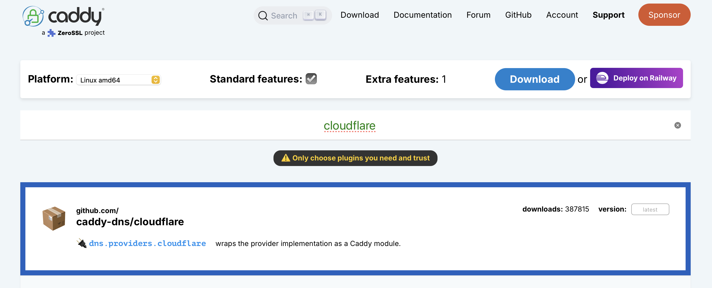

# Remote Access

Remote access refers to the ability to access your server outside of your home network. For example, when you leave the house, you aren't going to be able to access `http://<your_server_ip>`, because your network has changed from your home network to some other network (either your mobile carrier's or a local network in some other place). This means that you won't be able to access the services running on your server. There are many solutions on the web that solve this problem and we'll explore some of the easiest-to-use here.

## Table of Contents

- [Remote Access](#remote-access)
  - [Table of Contents](#table-of-contents)
  - [Prerequisites](#prerequisites)
  - [Tailscale](#tailscale)
    - [Installation](#installation)
    - [Exit Nodes](#exit-nodes)
    - [Local DNS](#local-dns)
    - [Third-Party VPN Integration](#third-party-vpn-integration)
    - [Accessing Services](#accessing-services)
  - [Reverse Proxy](#reverse-proxy)
    - [Caddy](#caddy)
      - [Installation](#installation-1)
      - [Configuration](#configuration)
    - [Cloudflare](#cloudflare)
      - [Setting up Cloudflare](#setting-up-cloudflare)
      - [Obtaining Let's Encrypt Certificates with Caddy](#obtaining-lets-encrypt-certificates-with-caddy)
      - [Troubleshooting](#troubleshooting)
  - [Next Steps](#next-steps)

## Prerequisites

This guide assumes the following:

- A running server with at least one service exposed on a port (e.g., Open WebUI on port 3000).
- Basic comfort with the terminal (running commands, editing files with `nano` or a similar editor).
- A Tailscale account (free tier is sufficient for personal use).
- (Optional, for reverse proxy section) A domain name registered with any registrar (~$2–15/year). You'll also need a Cloudflare account to manage DNS records.

To find your server's Tailscale IP, log in to the [Tailscale Admin Console](https://login.tailscale.com/admin/machines) and look up your device. Its Tailscale IP is displayed next to the device name (it will be in the `100.x.y.z` range).

## Tailscale

Tailscale is a peer-to-peer VPN service that combines many services into one. Its most common use-case is to bind many different devices of many different kinds (Windows, macOS, iOS, Android, etc.) on one virtual network. This way, all these devices can be connected to different networks but still be able to communicate with each other as if they were all on the same local network. Tailscale is not completely open source (its GUI is proprietary), but it is based on the [Wireguard](https://www.wireguard.com) VPN protocol and the remainder of the actual service is open source. Comprehensive documentation on the service can be found [here](https://tailscale.com/kb) and goes into many topics not mentioned here - I would recommend reading it to get the most out of the service.

On Tailscale, networks are referred to as tailnets. Creating and managing tailnets requires creating an account with Tailscale (an expected scenario with a VPN service) but connections are peer-to-peer and happen without any routing to Tailscale servers. This connection being based on Wireguard means 100% of your traffic is encrypted and cannot be accessed by anyone but the devices on your tailnet.

### Installation

First, create a tailnet through the Admin Console on Tailscale. Download the Tailscale app on any client you want to access your tailnet from. For Windows, macOS, iOS, and Android, the apps can be found on their respective OS app stores. After signing in, your device will be added to the tailnet.

For Linux, the steps required are as follows.

1) Install Tailscale
    ```
    curl -fsSL https://tailscale.com/install.sh | sh
    ```

2) Start the service
    ```
    sudo tailscale up
    ```

For SSH, run `sudo tailscale up --ssh`.

### Exit Nodes

An exit node allows access to a different network while still being on your tailnet. For example, you can use this to allow a server on your network to act as a tunnel for other devices. This way, you can not only access that device (by virtue of your tailnet) but also all the devices on the host network its on. This is useful to access non-Tailscale devices on a network.

To advertise a device as an exit node, run `sudo tailscale up --advertise-exit-node` (or `sudo tailscale set --advertise-exit-node`). To allow clients using this exit node to access the local network, configure those clients with `--exit-node-allow-lan-access` when connecting to the exit node.

### Local DNS

If one of the devices on your tailnet runs a [DNS-sinkhole](https://en.wikipedia.org/wiki/DNS_sinkhole) service like [Pi-hole](https://pi-hole.net), you'll probably want other devices to use it as their DNS server. Assume this device is named `poplar`. This means every networking request made by any device on your tailnet will send this request to `poplar`, which will in turn decide whether that request will be answered or rejected according to your Pi-hole configuration. However, since `poplar` is also one of the devices on your tailnet, it will send networking requests to itself in accordance with this rule and not to somewhere that will actually resolve the request. Thus, we don't want such devices to accept the DNS settings according to the tailnet but follow their otherwise preconfigured rules.

To reject the tailnet's DNS settings, run `sudo tailscale up --accept-dns=false`.

### Third-Party VPN Integration

Tailscale offers a [Mullvad VPN](https://mullvad.net/en) exit node add-on with their service. This add-on allows for a traditional VPN experience that will route your requests through a proxy server in some other location, effectively masking your IP and allowing the circumvention of geolocation restrictions on web services. Assigned devices can be configured from the Admin Console. Mullvad VPN has [proven their no-log policy](https://mullvad.net/en/blog/2023/4/20/mullvad-vpn-was-subject-to-a-search-warrant-customer-data-not-compromised) and offers a fixed $5/month price no matter what duration you choose to pay for.

To use a Mullvad exit on one of your devices, first find the exit node you want to use by running `sudo tailscale exit-node list`. Note the IP and run `sudo tailscale up --exit-node=<your_chosen_exit_node_ip>`.

> [!WARNING]
> Ensure the device is allowed to use the Mullvad add-on through the Admin Console first.

### Accessing Services

Now that Tailscale is set up, we can access services outside of the local network in two different ways. Say we have Open WebUI running on port 3000.

1. Reference a device's Tailscale IP: `http://100.x.y.z:3000`
2. Reference the tailnet name: `https://<device>.<tailnet_name>.ts.net:3000`

For example, if the device running Open WebUI is called `poplar` and the tailnet is called `beach-volleyball`, the URL would be `https://poplar.beach-volleyball.ts.net:3000`.

However, this is limited to Tailscale: their domain, based on your tailnet name. In the next section, we will go over the industry-standard way of accessing services behind a secure HTTPS connection: using a custom fully-qualified domain name, or FQDN.

## Reverse Proxy

We will introduce a reverse proxy engine into our setup here. A reverse proxy enables obfuscation of the actual IPs that services run on and makes it easy to access services by their **name**, instead of their **port**. We do this by assigning a subdomain to a port. A subdomain is a domain that is part of another domain. For example, `shop.example.com` is a subdomain of `example.com`. By mapping a subdomain to a port, we can reach services in a far more intuitive way than using device IP + port.

Let's take the Open WebUI on port 3000 example again. This section requires the ownership of a domain; for this example, we'll use `example.com`. The flow of information is as follows:

```
Request -> https://owui.example.com -> 100.x.y.z:3000 -> Open WebUI
```

There are many reverse proxy engines available but one, in particular, is ubiquitous and very easy to work with: Caddy.

### Caddy

🌟 [**GitHub**](https://github.com/caddyserver/caddy)  
📖 [**Documentation**](https://caddyserver.com/docs)

Caddy is a web server and reverse proxy written in Go. Its primary advantage over other reverse proxies is automatic HTTPS certificate provisioning via Let's Encrypt, which happens with zero configuration. Caddy also supports HTTP/3 out of the box and uses a human-friendly configuration format called Caddyfile.

#### Installation

On Debian/Ubuntu-based Linux distributions:

1. Install prerequisites and add Caddy's GPG key:
    ```bash
    sudo apt install -y debian-keyring debian-archive-keyring apt-transport-https curl
    curl -1sLf 'https://dl.cloudsmith.io/public/caddy/stable/gpg.key' | sudo gpg --dearmor -o /usr/share/keyrings/caddy-stable-archive-keyring.gpg
    ```

2. Add the Caddy repository:
    ```bash
    curl -1sLf 'https://dl.cloudsmith.io/public/caddy/stable/debian.deb.txt' | sudo tee /etc/apt/sources.list.d/caddy-stable.list
    ```

3. Update packages and install Caddy:
    ```bash
    sudo apt update
    sudo apt install caddy
    ```

On other platforms, refer to the [official installation guide](https://caddyserver.com/docs/install).

#### Configuration

Caddy's main configuration file is the Caddyfile, typically located at `/etc/caddy/Caddyfile`. Its syntax is straightforward: each site block specifies a domain and the directives for handling requests.

1. Modify the Caddyfile:
    ```bash
    sudo nano /etc/caddy/Caddyfile
    ```
2. Add a route for a subdomain to a local service:
    ```caddyfile
    owui.example.com {
        reverse_proxy 100.x.y.z:3000
    }
    ```

    Caddy will automatically obtain and renew an SSL certificate for `owui.example.com` and serve traffic over HTTPS. No manual certificate configuration is required.

3. Configure other services (if required):
    ```caddyfile
    owui.example.com {
        reverse_proxy 100.x.y.z:3000
    }

    dashboard.example.com {
        reverse_proxy 192.168.a.b:3001
    }

    grafana.example.com {
        reverse_proxy 100.x.y.z:3002
    }
    ```

4. After editing the Caddyfile, format and reload the configuration:
    ```bash
    sudo caddy fmt --overwrite /etc/caddy/Caddyfile
    sudo systemctl reload caddy
    ```

    The `caddy fmt` command formats the Caddyfile in-place. The `systemctl reload` command sends a signal to the running Caddy service to reload its configuration without dropping connections.

Caddy runs as a systemd service by default on Linux. Use `sudo systemctl status caddy` to check its state and `journalctl -u caddy` to view logs. To ensure Caddy starts automatically on boot, run:

```bash
sudo systemctl enable caddy
```

> [!TIP]
> IPs are not limited to Tailscale-specific IPs or a single device! You can route to any device, with or without Tailscale, that Caddy can reach via IP. Tailscale simply makes a setup like this more secure: only users in your tailnet can access `100.x.y.z`, so only those users have their requests resolved. Any unauthorized actor attempting to go to `*.example.com` will be met with a "Server not found" response. This automatic rejection of unauthorized users requires extra configuration without Tailscale but is definitely doable. Caddy supports built-in rate limiting (`rate_limit`) and access control (`request_body`, `respond`) for securing exposed services.

### Cloudflare

Before Caddy can route traffic to your services, your domain's Domain Name System (DNS) records need to resolve to your server. Machines only communicate in IPs; a machine does not inherently "know" where a certain domain should point. Thus, a DNS provider is a huge registry of pairs of IP addresses and domains: a way for devices to chart what domains point to what IPs. This section covers setting up DNS with Cloudflare and obtaining Let's Encrypt certificates using the DNS-01 challenge. Cloudflare is a large compan that provides a variety of internet-related services, DNS being one of the largest.

> [!IMPORTANT]
> Exposing services to the public Internet via custom domains requires opening ports 80 and 443 on your router, which **can be dangerous** if misconfigured. If you're unfamiliar with firewall rules and service hardening, stick to Tailscale IPs as backend routes. Tailscale uses [hole punching](https://en.wikipedia.org/wiki/Hole_punching_(networking)) to bypass port forwarding entirely, keeping your services accessible only to authorized tailnet users.

#### Setting up Cloudflare

1. Add your domain to Cloudflare: Create a free account at [Cloudflare](https://dash.cloudflare.com) and add your domain. Cloudflare will provide nameservers to replace your registrar's defaults.

2. Create a wildcard DNS record: In Cloudflare's DNS dashboard, add an **A record** with the name `*` pointing to your server's public IP address. This single record will resolve all subdomains (`owui.example.com`, `dashboard.example.com`, etc.) to the same IP.

    | Type | Name | IPv4 address          | Proxy status          |
    | ---- | ---- | --------------------- | --------------------- |
    | A    | `*`  | `<your_tailscale_ip>` | DNS only (grey cloud) |

    Set **Proxy status** to **DNS only** (grey cloud) so traffic is routed directly to your server. This will most likely happen automatically because Tailscale IPs are considered "reserved" by Cloudflare.

3. Verify propagation: Run `dig owui.example.com` or visit [DNS Checker](https://dnschecker.org) to confirm the wildcard record resolves correctly.

> [!NOTE]
> Cloudflare isn't the only option. Caddy supports DNS-01 challenges with 75+ DNS providers through the [caddy-dns](https://github.com/caddy-dns) project, including AWS Route 53, DigitalOcean, Google Cloud DNS, and more. Replace `cloudflare` in the Caddyfile and installation steps with your provider's module name.

#### Obtaining Let's Encrypt Certificates with Caddy

[ACME](https://en.wikipedia.org/wiki/Automatic_Certificate_Management_Environment) (Automatic Certificate Management Environment) is a protocol that automates SSL/TLS certificate issuance and renewal. It offers three types of challenges to verify domain ownership: HTTP-01, TLS-ALPN-01, and DNS-01. The HTTP-01 challenge serves a file on port 80, and TLS-ALPN-01 uses port 443, which the certificate authority (CA) uses to verify ownership. However, with Tailscale, neither port is directly accessible from the public Internet. In this case, we use the DNS-01 challenge with Caddy's Cloudflare module, which verifies ownership by creating temporary TXT records in your domain's DNS:

1. Create a Cloudflare API token: Go to **Profile > API Tokens > Create Token**, and use the **Edit zone DNS** template. Select your domain and save the token.

2. Export the token as an environment variable:
    ```bash
    echo 'export CLOUDFLARE_API_TOKEN=your-token-here' >> ~/.bashrc
    source ~/.bashrc
    ```

3. Install Caddy with the Cloudflare DNS module: 
    

   1. Visit the [Caddy download page](https://caddyserver.com/download).
   2. Select your platform (Linux amd64, for this guide).
   3. Click on the `caddy-dns/cloudflare` module. Its element box will turn blue.
   4. Right-click the download button and copy its URL.
   5. After getting the URL, run the following:
        ```bash
        sudo curl -o /usr/bin/caddy -L "<url_from_step_4>"
        ```

4. Configure the Caddyfile to use DNS-01 challenges:
    ```caddyfile
    *.example.com {
        tls {
            dns cloudflare {env.CLOUDFLARE_API_TOKEN}
        }
        reverse_proxy 100.x.y.z:3000
    }
    ```

    Caddy will automatically create and verify TXT records through the Cloudflare API to prove domain ownership, then issue a wildcard certificate for `*.example.com`.

> [!TIP]
> A wildcard certificate (`*.example.com`) is **very** convenient when running many subdomains. Going this route, compared to having a DNS record for each subdomain separately, you only need to provision and renew a single certificate instead of one per subdomain. It is technically less secure in case of a breach but, if you're using any kind of peer-to-peer VPN, this should not really be a problem.


> [!WARNING]
> If your setup is like mine, Caddy may send a malformed DNS-01 challenge to Cloudflare. In case your certificate isn't issued automatically, log in to the Cloudflare dashboard, navigate to your domain's DNS records, open the TXT record for `*`, and wrap the challenge in `""` (double quotation marks). This will allow the challenge to be read by Cloudflare successfully.

#### Troubleshooting

- **Caddy fails to start.** Run `sudo systemctl status caddy` to check for errors. Run `sudo caddy validate --config /etc/caddy/Caddyfile` to check for issues before reloading.

- **Certificate isn't being issued.** Check Caddy's logs with `journalctl -u caddy -n 50` to see the ACME challenge output. Ensure your Cloudflare API token has the **Edit zone DNS** permission and that the `CLOUDFLARE_API_TOKEN` environment variable is set correctly (`echo $CLOUDFLARE_API_TOKEN`). Also make sure that your DNS-01 challenge is not malformed - it should be wrapped in double quotation marks.

- **Domain doesn't resolve.** Run `dig owui.example.com` or visit [DNS Checker](https://dnschecker.org) to verify your wildcard A record propagated. If you recently changed the record, DNS propagation can take up to 24 hours (though Cloudflare typically propagates within minutes).

- **Service returns a 502/504 error.** This means Caddy can reach the domain but cannot connect to the backend service. Verify the service is running on the expected port and that the IP address in the Caddyfile is correct. You can test from the Caddy host with `curl http://100.x.y.z:3000`.

- **Can't access the domain from outside your network.** Ensure port 443 is forwarded on your router to your server's local IP. With DNS-01 challenges, only port 443 needs to be open (port 80 is not required). If you're unsure about port forwarding, stick to accessing services via Tailscale IPs directly.

## Next Steps

With remote access configured, your self-hosted services are reachable from anywhere. Consider the following to further improve your setup:

- Monitor your services with tools like [Uptime Kuma](https://github.com/louislam/uptime-kuma) or [Healthchecks](https://healthchecks.io) to get notified if a service goes down.
- Back up your configuration files, especially the Caddyfile and any service-specific configs.
- Explore Tailscale Funnel (`tailscale funnel`) for selectively exposing services to the public Internet without a domain or reverse proxy.
- Read the [Tailscale KB](https://tailscale.com/kb) and [Caddy documentation](https://caddyserver.com/docs) for advanced topics not covered here.